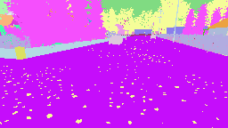
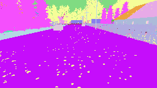
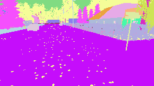
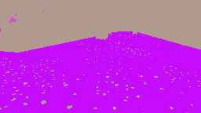
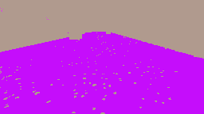
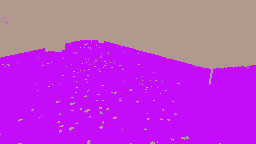
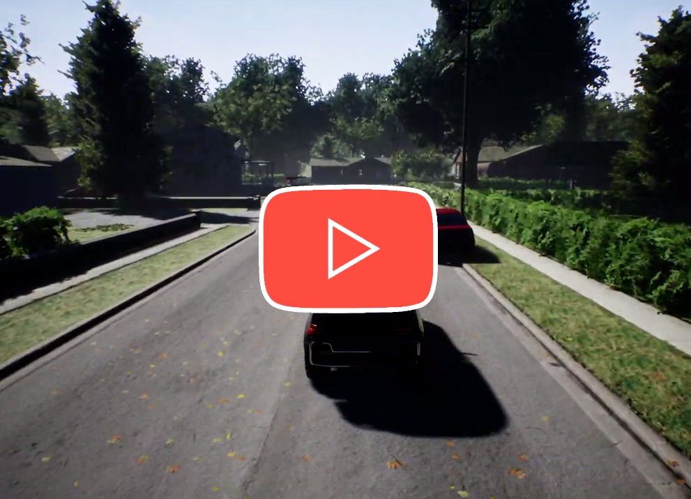

#  Using imitation and reinforcement learning to drive a car in AirSim
The agent was trained to drive counter-clockwise around all blocks in the neighbourhood environment from <a href="https://microsoft.github.io/AirSim/">AirSim</a>.

## Imitation learning
The human driver recorded the view from three cameras using segmented images.\
For that, the *settings.json* file has to be moved into the AirSim settings directory.

    
    
    

    
    
    

Those images are then masked for the ground, concatenating the last 3 binary-images as network input.\
Unfortunately the sidewalk has the same segmentation-id as the street.

The model was then trained on the collected data, imitating the human driver,\
correcting the steering label for the left and right view to get back on track [<a href="https://arxiv.org/abs/1604.07316">Bojarski et al. ‘16, NVIDIA</a>].

Watch the agent drive:

    

## Reinforcement learning
Starting with the imitation-trained model, it was further improved using continuous PPO (Proximal Policy Optimization).\
For exploration and learning, a fixed standard-deviation was used. The agents target was to maximize the travelled distance with a reasonable speed.

Watch the reinforced agent drive:

    

